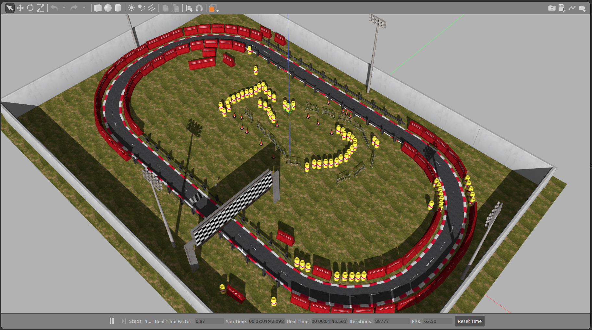
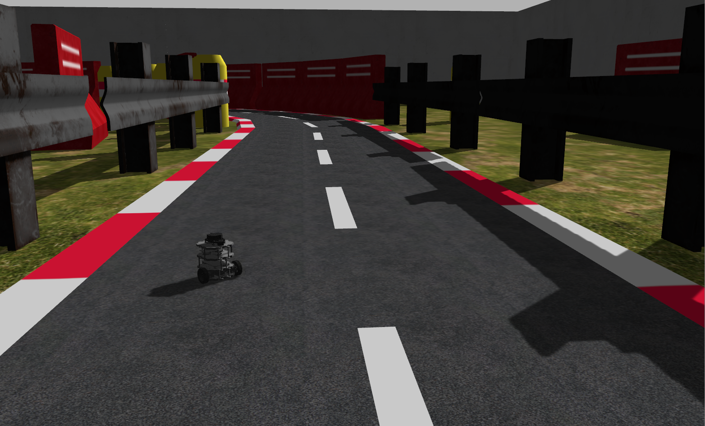
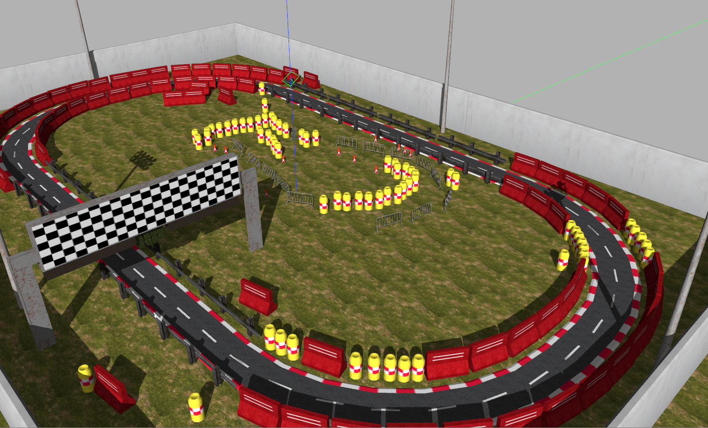
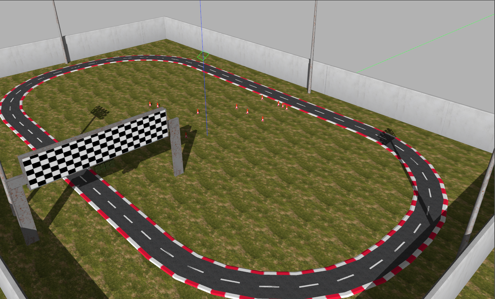
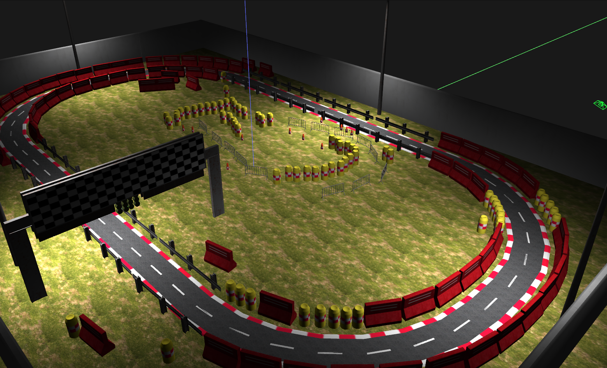

# AWS RoboMaker Racetrack World ROS package



**Visit the [RoboMaker website](https://aws.amazon.com/robomaker/) to learn more about building intelligent robotic applications with Amazon Web Services.**

# Include the world from another package

* Update .rosinstall to clone this repository and run `rosws update`
```
- git: {local-name: src/aws-robomaker-racetrack-world, uri: 'https://github.com/aws-robotics/aws-robomaker-racetrack-world.git', version: ros2}
```
* Add the following to your launch file:

* Add the following include to the ROS2 launch file you are using:

```python
    import os
    from ament_index_python.packages import get_package_share_directory
    from launch import LaunchDescription
    from launch.actions import IncludeLaunchDescription
    from launch.launch_description_sources import PythonLaunchDescriptionSource
    def generate_launch_description():
        racetrack_pkg_dir = get_package_share_directory('aws_robomaker_racetrack_world')
        racetrack_launch_path = os.path.join(warehouse_pkg_dir, 'launch')
        racetrack_world_cmd = IncludeLaunchDescription(
            PythonLaunchDescriptionSource([racetrack_launch_path, '/racetrack.launch.py'])
        )
        ld = LaunchDescription()
        ld.add_action(racetrack_world_cmd)
        return ld
```

# Load directly into Gazebo (without ROS)
```bash
export GAZEBO_MODEL_PATH=`pwd`/models
gazebo worlds/racetrack_day.world
```

# ROS Launch with Gazebo viewer (without a robot)
```bash
# build for ROS2
rosdep install --from-paths . --ignore-src -r -y
colcon build

# run in ROS2
source install/setup.sh
ros2 launch aws_robomaker_racetrack_world view_racetrack.launch.py
```

# Robot Simulation
A good initial robot position near the start line is (2.75, -14.00, 0.0).   



# Building
Include this as a .rosinstall dependency in your SampleApplication simulation workspace and run the following commands:

```bash
$ rosws update
$ rosdep install --from-paths . --ignore-src -r -y
$ colcon build
```

# Modes
## Day 
```
ros2 launch aws_robomaker_racetrack_world view_racetrack.launch.py gui:=true mode:=day
```


## Day Emtpy 
```
ros2 launch aws_robomaker_racetrack_world view_racetrack.launch.py gui:=true mode:=day_empty
```


## Night
```
ros2 launch aws_robomaker_racetrack_world view_racetrack.launch.py gui:=true mode:=night
```


